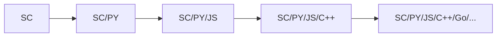

呃 你好 陌生人

不行我怎么写博客也能社恐（

# 关于我

从何谈起呢？

爱写 React 和 Go 的全栈 (?)，四年OIer ~~然而 vibe 上瘾~~。

## 我的历程

从小学一年级社团第一次接触图形化 (Mind+) 至今，

我至少~~学会~~了解了7种编程语言，直到如今基本什么都写）

## 我做过的项目

迄今为止我做过最大的自然就是 [Bilup](https://github.com/Bilup) ，

然而近期（2026年9月16日）我打算逐步放手并归档，参见[这里](../p/bilup-past/#bilup-%E4%B9%8B%E8%A1%B0)得知原因

## TA评 (?)

滚木